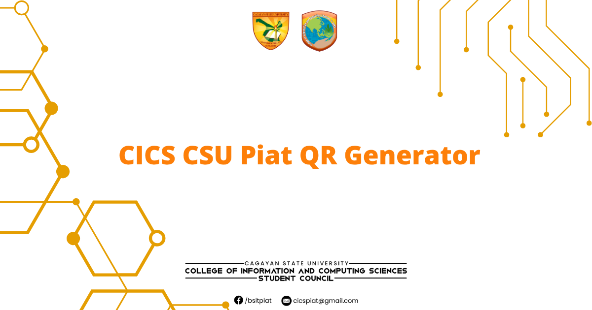

<p align="center">
  
</p>

<h2 align="center">CICS CSU Piat QR Generator</h2>

<p align="center">
  Generate student-ready QR codes using your ID and name or bulk lists.<br>
  <strong>Free</strong>, <strong>offline-ready</strong>, and <strong>dark-mode enabled</strong>.
</p>

---

## ✨ Features

- **Modern App UI:** Redesigned with a responsive, 2-column app-style layout.
- **Dark Mode:** Supports both manual-toggle and system-preferred dark mode.
- **Single QR Generator:** Enter a Student ID and Name to generate a custom QR code. The ID is hidden in the final image, with only the name displayed.
- **Bulk QR Generator:** Paste a list of `ID|Name` pairs to generate multiple QR codes at once.
- **Live History Preview:** Click on any QR code in your history (on both single and bulk pages) to see a large preview in a modal window.
- **Downloadable Outputs:** Save each QR as a PNG file or download all selected bulk QRs as a `.zip` file.
- **Offline PWA:** Works as an installable Progressive Web App (PWA) with full offline functionality.

---

## 🌐 Live Demo

Check out the working version at:  
https://www.cics-qrgenerator.site/  

---

## 🖥️ Tech Stack

- Pure HTML, CSS, & JavaScript
- Service Worker for PWA & offline caching

---

## 📌 Usage

1.  Clone or download the repository.
2.  Open `index.html` in your browser.

### Single QR
1.  Enter the **Student ID** (e.g., `089774`) in the first field.
2.  Enter the **Name** (e.g., `BAOIT, JEYLO M.`) in the second field.
3.  Click "Generate QR".
    * The QR code data will be `089774|BAOIT, JEYLO M.`.
    * The image will only show the name `BAOIT, JEYLO M.`.

### Bulk QR
1.  Click on the "Bulk QR" tab.
2.  Paste your data into the text area using the format `ID|Name` for each line.
    ```
    ID123|LAST, FIRST M.I.
    ID456|DOE, JOHN A.
    ID789|SMITH, JANE B.
    ```
3.  Click "Generate All".

---

## 📬 Contact & Legal

- Simple cookie banner for ad personalization (Google)
- Includes links for Contact and Privacy Policy
- © 2025 CICS QR Generator – Jeylo Baoit